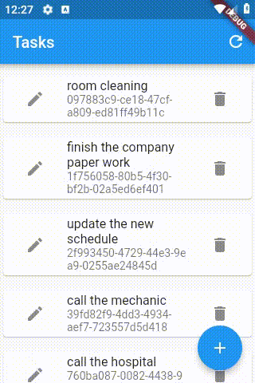

# e007_flutter_reorderable_listview_e004base

## Step 1

    ReorderableListView(
    children: <Widget>[
    ],

## Step 2

    children: <Widget>[
        for (final task in tasks)
        TaskWidget(
            key: Key(task.guid),
            taskOpj: task,
            notifyParent: refresh,
        ),
    ], 

## Step 3

    onReorder: (oldIndex, newIndex) {
        if (newIndex > oldIndex) {
        newIndex -= 1;
        }
        setState(() {
        if (newIndex > oldIndex) {
            newIndex -= 1;
        }
        final TaskOpj item = tasks.removeAt(oldIndex);
        tasks.insert(newIndex, item);
        });
    },

## Full code

    ReorderableListView(
    children: <Widget>[
        for (final task in tasks)
        TaskWidget(
            key: Key(task.guid),
            taskOpj: task,
            notifyParent: refresh,
        ),
    ],
    onReorder: (oldIndex, newIndex) {
        if (newIndex > oldIndex) {
        newIndex -= 1;
        }
        setState(() {
        if (newIndex > oldIndex) {
            newIndex -= 1;
        }
        final TaskOpj item = tasks.removeAt(oldIndex);
        tasks.insert(newIndex, item);
        });
    },
    )

## Ref

- [ReorderableListView (Flutter Widget of the Week) - YouTube](https://www.youtube.com/watch?v=3fB1mxOsqJE&list=PLjxrf2q8roU23XGwz3Km7sQZFTdB996iG&index=43)

- [ReorderableListView class - material library - Dart API](https://api.flutter.dev/flutter/material/ReorderableListView-class.html)

- [Search · ReorderableListView](https://github.com/flutter/flutter/search?q=ReorderableListView&unscoped_q=ReorderableListView)

- [flutter/reorderable_list_test.dart at 3c93b65a9bcc8aa723231eff4eb0a7e19b2daccf · flutter/flutter](https://github.com/flutter/flutter/blob/3c93b65a9bcc8aa723231eff4eb0a7e19b2daccf/packages/flutter/test/material/reorderable_list_test.dart)

- [flutter/reorderable_list_demo.dart at 8c5a41113e2c0731147fe62a941ca33b9a1e8e8a · flutter/flutter](https://github.com/flutter/flutter/blob/8c5a41113e2c0731147fe62a941ca33b9a1e8e8a/examples/flutter_gallery/lib/demo/material/reorderable_list_demo.dart)